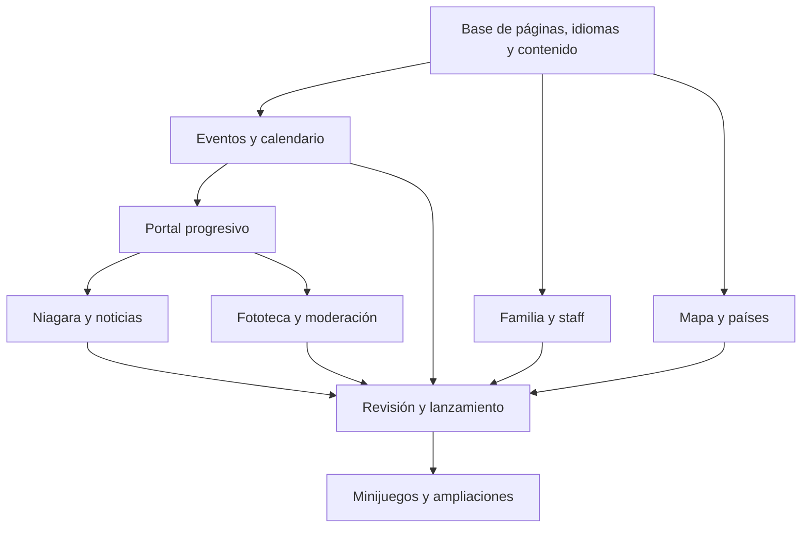

# NC Latin Club — Plan de los siguientes avances

Actualización: 10 de octubre de 2026, America/Toronto.

Estado: inicio nocturno aprobado; agenda pública implementada; próximos hitos pendientes.

Base: brief de contexto y preferencias posteriores del fundador; agenda pública `ba5c36c` y correcciones `8a240dd`.

## 1. Qué queremos construir

Una casa digital de **NC LATIN CLUB** que haga sentir pertenencia, permita encontrar eventos y descubrir culturas latinoamericanas, y pueda mantenerse por futuras generaciones del club sin programar.

Dirección visual elegida el 10 de octubre de 2026: **festival urbano nocturno, con luces y energía**, para una comunidad joven en sus 20s. El prototipo anterior resultó demasiado sereno para el grupo. El inicio combinará fondo azul noche, tipografía sans fuerte, amarillo luminoso y acentos coral/cian, composiciones de cartel y un festival callejero latino imaginado. El movimiento acompaña el recorrido y respeta la preferencia de movimiento reducido. La magia nace de la luz, la profundidad y el descubrimiento cultural. El usuario descartó el patio como protagonista y la decoración floral como lenguaje dominante.

Las preferencias posteriores del usuario prevalecen sobre las notas históricas del brief: título **NC LATIN CLUB**, nueva dirección nocturna, botones de contacto solicitados, patrocinio NCSAC y mapa regional hasta Estados Unidos. El brief original continúa siendo material de contexto; este documento resume el trabajo siguiente.

## 2. Punto de partida real

| Área | Estado comprobado en el repositorio |
| --- | --- |
| Inicio | Prototipo nocturno aprobado, Familia, Eventos enlazados a la agenda, Raíces, Niagara y contacto. |
| Idiomas | EN por defecto; idioma compartido entre inicio, agenda y detalle. Una recarga vuelve a EN; sin rutas traducidas ni metadatos por idioma. |
| Eventos | Primera entrada real: Latin Fiesta!, 23–24 de octubre de 2026, The Core, organizada por International; datos y enlace NC Engage aportados por el usuario. `/events`, calendario de seis semanas, detalles y galerías opcionales implementados. Out of NC y Fechas latinas esperan contenido verificado. |
| Mapa | Ilustración con México, Colombia, Perú y Brasil y diálogos accesibles. No es el mapa/globo regional definitivo. |
| Contacto | Mailto al correo solicitado con el mensaje de unión prellenado. |
| Instagram | Falta el perfil oficial; la acción muestra un aviso pendiente. |
| Identidad | El logo oficial existe según el usuario, pero no está incorporado al repositorio. |
| Administración | Sin autenticación, base de datos, almacenamiento administrado ni portal. |
| Páginas internas | Inicio, `/events`, `/events/[slug]` y 404 propia bilingüe. |
| GitHub | Avances en `work`; commit y push tras cada hito verificado. `main` permanece separado. |

Las comprobaciones anteriores de lint, build y navegador corresponden al prototipo. Cada nuevo hito tendrá su propia verificación.

## 3. Forma de avanzar recomendada

Recomiendo entregas verticales: una función pública completa y revisable por avance, con contenido separado de la presentación desde el principio. Así Eventos puede funcionar pronto y después recibir los mismos datos del portal.

Otras dos opciones tienen costes claros: construir primero todas las pantallas acelera la revisión visual, pero retrasa su mantenimiento; construir primero todo el portal retrasa el sitio público y obliga a definir campos de funciones todavía sin probar. La propuesta combina el calendario y el staff temprano con un portal progresivo.

Preparar los modelos de contenido ahora; elegir el proveedor de administración antes de construir el portal. Cada subsistema tendrá un diseño y un plan técnico propios cuando le toque, en vez de un único plan de implementación para todo el sitio.

## 4. Páginas propuestas

| Ruta principal propuesta | Función |
| --- | --- |
| `/` | Presentar el club y abrir el recorrido; destacar eventos y cultura. |
| `/events` | Próximos eventos, pasados y calendario latino. |
| `/events/[slug]` | Información de un evento confirmado e inscripción cuando exista. |
| `/familia` | Historia, misión, valores y bienvenida. |
| `/team` | Staff con nombres, roles y fotos autorizados. |
| `/explore` | Mapa/globo regional y selección de países. |
| `/explore/[country]` | Información cultural revisada de cada país. |
| `/niagara` | Discover Latin Niagara con lugares y actividades verificados. |
| `/news` y `/news/[slug]` | Noticias y avisos del club. |
| `/gallery` | Fototeca pública aprobada, organizada por eventos o álbumes. |
| `/play` | Entrada futura a minijuegos culturales. |
| `/admin` | Edición, publicación y moderación autorizadas. |

El contacto puede seguir como sección de inicio; una página `/join` solo se añade si hay instrucciones que necesiten más espacio. Conservar los enlaces actuales de inicio durante la transición. Añadir enlaces públicos a nuevas páginas cuando funcionen. Priorizar Eventos, Explore y Familia en la navegación; agrupar el resto para mantener un menú simple.

Para la entrega de Events, el fundador aprobó conservar el selector EN/ES del prototipo mediante un contexto compartido: navegar mantiene el idioma y una recarga completa comienza en inglés. Las rutas con prefijo `/es` y metadatos localizados siguen como propuesta para un hito posterior de internacionalización.

## 5. Hitos y criterios de finalización

### Hito 1 — Base para páginas e información editable

**Entregable:** navegación, idiomas y acceso al contenido preparados para crecer.

- [x] Confirmar la estrategia EN/ES y compartir encabezado, pie y controles entre páginas.
- [x] Preservar el título, el paisaje, Discover Latin Niagara, el patrocinio y el correo actuales.
- [ ] Incorporar el logo y la cuenta de Instagram cuando el fundador los facilite.
- [x] Separar contratos de contenido de su fuente: primero archivos locales; después el portal suministrará los mismos campos.
- [ ] Definir contenido global y por página, medios, eventos y fechas culturales; ampliar con staff, países, noticias y directorio cuando corresponda.

**Terminado cuando:** navegar y cambiar de idioma conserva contexto, las rutas iniciales se renderizan con el idioma correcto y los componentes consumen contenido sin depender de un proveedor concreto. No debe perderse ningún comportamiento del inicio.

### Hito 2 — Eventos y calendario latino

**Entregable:** `/events`, detalles de eventos y calendario mensual que comparten los datos con el inicio.

- [x] Alternar lista y calendario, avanzar y retroceder meses y volver al mes actual.
- [x] Distinguir eventos del club y fechas culturales; una celebración cultural no implica un encuentro organizado por el club.
- [x] Incorporar las pestañas solicitadas **At NC** y **Out of NC**: eventos del college y eventos latinos de la región, respectivamente. Conservar el organizador real de cada entrada.
- [ ] Preparar una selección regional con ciudad, fecha, precio y enlace a la fuente oficial. Niagara es el alcance inicial propuesto; cualquier ampliación se decide antes de buscar contenido. Revisar cada entrada antes de publicar; la lista no promete cobertura exhaustiva ni sincronización automática.
- [x] Seleccionar una fecha para ver sus entradas; fechas sin entradas muestran un estado claro.
- [x] Mostrar próximos y pasados, lugar, horario, descripción y enlace de inscripción confirmado cuando exista.
- [x] Reflejar cancelaciones o reprogramaciones sin conservar datos contradictorios.
- [x] Mantener próximamente y meses vacíos útiles hasta que haya contenido real.

- [x] Mostrar cero, una o varias imágenes ordenadas por entrada con galería accesible, swipe, miniaturas y fallback ante fallo.

**Estado:** recorrido funcional implementado; contenido regional y cultural pendiente de verificación. La carga de imágenes mediante admin conserva su hito propio.

**Datos importantes:** eventos con hora usan un timestamp con zona y se presentan en `America/Toronto`. Fechas culturales de día completo usan fecha de calendario, sin convertirlas a medianoche UTC. Las celebraciones tienen país o ámbito y fuente editorial; las que cambian de fecha se revisan para cada año.

**Terminado cuando:** una misma entrada tiene la misma fecha en inicio, lista, calendario y detalle; funcionan teclado y pantalla táctil; están comprobados meses vacíos, varios eventos en un día, cambio de año, horario de verano y fechas de día completo. Los datos de prueba quedan fuera del contenido público.

### Hito 3 — Familia y staff

**Entregable:** `/familia` y `/team` con identidad y personas reales.

- [ ] Presentar la misión y la historia con el tono inclusivo del inicio.
- [ ] Preparar perfiles con nombre, cargo, biografía breve, foto y orden de aparición.
- [ ] Publicar solo perfiles y fotos aprobados; mantener un estado honesto mientras falten.
- [ ] Permitir renovar el equipo sin borrar la historia del club, con contenido preparado para administración.

**Terminado cuando:** el visitante entiende qué hace el club y quién lo organiza; el sitio funciona con cualquier cantidad de perfiles, incluidos cero, y cada perfil tiene versión EN/ES.

### Hito 4 — Mundo latino interactivo

**Entregable:** sustituir la ilustración de cuatro países por una experiencia regional completa en `/explore`, con una entrada ligera desde el inicio.

- [ ] Probar primero interacción y rendimiento del globo 3D antes de elegir la librería.
- [ ] Mostrar únicamente la región acordada: Sudamérica, Centroamérica, Caribe, México y Estados Unidos. Resolver la lista de países y territorios y su encuadre antes de preparar geometrías.
- [ ] Arrastrar o rotar, hacer zoom, seleccionar un país y restablecer la vista.
- [ ] Abrir un popup con información de ese país y acceso a su página cultural.
- [ ] Incorporar geometrías reales con licencia compatible y datos culturales revisados.
- [ ] Ofrecer selector/lista accesible y vista alternativa cuando 3D no esté disponible. Cargar la experiencia pesada cuando se necesite.

**Terminado cuando:** cada país del conjunto acordado se puede seleccionar por toque y teclado, los popups corresponden a la selección, no aparece geografía ajena a la región, y el inicio sigue cargando con rapidez. El mapa representa culturas y países; no ubicaciones de miembros.

### Hito 5 — Portal de administración

**Entregable:** el equipo puede mantener el sitio sin editar archivos de código.

Primera entrega del portal: acceso, permisos, ajustes globales, medios y eventos. Segunda entrega: textos por página, staff, países y directorio. Tercera entrega: noticias y moderación de la fototeca.

- [ ] Elegir proveedor, presupuesto y responsables de las cuentas antes de crear servicios.
- [ ] Definir Admin y Editor con permisos comprobados en el servidor.
- [ ] Editar logo, imágenes, textos EN/ES, enlaces, patrocinio y contenido destacado.
- [ ] Gestionar eventos y fechas culturales, staff, países, noticias y lugares de Niagara.
- [ ] Guardar borradores, revisar vista previa y publicar; el público solo recibe contenido publicado.
- [ ] Mostrar cambios sin exigir una intervención manual del desarrollador; definir la actualización de caché al publicar.
- [ ] Registrar cambios y permitir recuperar contenido ante errores. Preparar exportación/respaldo y guía de relevo del equipo.

**Propuesta técnica pendiente:** Supabase puede cubrir autenticación, base de datos y almacenamiento, pero requiere construir las pantallas editoriales. Un CMS administrado aporta edición y localización más rápido, aunque los envíos de visitantes y su moderación pueden necesitar otro servicio. Comparar ambas opciones usando el calendario y el flujo de fotos como casos concretos; precios, disponibilidad y proveedores se verifican al decidir.

**Terminado cuando:** un admin modifica un evento, un texto, una imagen y un enlace y verifica el resultado público; un editor no puede gestionar permisos; un visitante no puede leer borradores ni ejecutar acciones de administración. La edición cubre contenido dentro de las plantillas; un constructor libre de layouts queda fuera del primer portal.

### Hito 6 — Discover Latin Niagara y noticias

**Entregable:** directorio útil y noticias editables desde el portal.

- [ ] Crear categorías para gastronomía, cultura y encuentros, con lugares y enlaces verificados.
- [ ] Añadir filtros sencillos según la cantidad real de contenido; un mapa local se evalúa cuando aporte valor.
- [ ] Publicar noticias con fecha, imagen opcional, texto bilingüe y enlace individual.
- [ ] Relacionar noticias o lugares con eventos cuando exista un vínculo real.
- [ ] Poder corregir y archivar contenido desde administración.

**Terminado cuando:** el equipo publica y actualiza una entrada de cada tipo; funcionan categorías vacías, enlaces y versiones traducidas. Una noticia sobre un evento enlaza a su información actualizada.

### Hito 7 — Fototeca e Instagram

**Entregable:** recuerdos autorizados y conexión con la cuenta oficial.

- [ ] Publicar álbumes y fotos aprobadas con textos alternativos y asociación a eventos cuando corresponda.
- [ ] Añadir después el envío de fotos por visitantes: información de autorización, carga controlada y confirmación de recepción.
- [ ] Mantener los envíos pendientes en almacenamiento privado hasta la aprobación del admin; permitir rechazo y retirada de imágenes publicadas.
- [ ] Definir límites de tamaño, formatos y frecuencia de envío según el servicio elegido.
- [ ] Activar el enlace oficial de Instagram y evaluar posts seleccionados mediante integraciones permitidas, con alternativa si la plataforma o el visitante bloquea el contenido externo.

**Terminado cuando:** un visitante envía una foto, un admin la revisa y solo una aprobación la hace pública; los originales pendientes no quedan accesibles mediante enlaces públicos. La fototeca sigue funcionando si Instagram no carga.

### Hito 8 — Primera versión pública y relevo

**Entregable:** sitio listo para uso real con las funciones esenciales mantenibles.

- [ ] Revisar textos e imágenes aprobados, enlaces reales y traducciones.
- [ ] Completar metadatos por idioma, sitemap, previews sociales, 404 y estados de carga/error.
- [ ] Comprobar accesibilidad, navegación, rendimiento del mapa y visualización móvil.
- [ ] Configurar el destino de hosting y dominio elegidos, vistas previas, producción y recuperación de una versión anterior.
- [ ] Entregar instrucciones de edición y transferencia de acceso a futuras directivas.

**Terminado cuando:** un visitante puede conocer al club, descubrir cultura, encontrar eventos y unirse; el equipo puede mantener el contenido; están resueltos los datos y accesos necesarios para publicar. Fechas, proveedor, costes y dominio dependen de las decisiones del fundador.

### Hito 9 — Minijuegos y otras experiencias

**Entregable inicial:** trivia cultural en `/play`, sin cuenta obligatoria, con explicaciones y preguntas revisadas editables desde administración.

Después se pueden sumar otros minijuegos, diccionario regional y playlist. Cada uno se diseña por separado. After Dark y chat son ideas del brief para una etapa posterior; necesitarán definición de acceso y moderación antes de convertirse en funciones.

**Terminado cuando:** el primer juego funciona en móvil y con teclado, se puede volver a jugar y el equipo mantiene el banco de preguntas.

## 6. Dependencias y primera versión

Primera versión recomendada: inicio, eventos/calendario, Familia/staff, mapa/países, Niagara, noticias, fototeca aprobada, enlaces sociales y administración de ese contenido. Los envíos de fotos pueden activarse después de la fototeca inicial. Minijuegos, diccionario, playlist ampliada y áreas privadas quedan después del lanzamiento esencial.

El orden es una recomendación: la recopilación de fotos, perfiles, eventos y lugares puede avanzar desde ahora. Cada hito se divide en cambios revisables; no tiene que esperar a que exista contenido de todas las áreas.

## 7. Datos y decisiones que faltan

| Necesario | Cuándo afecta al trabajo |
| --- | --- |
| Archivo del logo y enlace/@ oficial de Instagram | Identidad final y acciones sociales; la base puede avanzar mientras faltan. |
| Próximos eventos confirmados y fuentes regionales | Latin Fiesta! ya fue aportado y publicado en el inicio. Faltan entradas verificadas para Out of NC y el calendario cultural. |
| Nombres, cargos, biografías y fotos aprobados del staff | Publicar perfiles reales. |
| Países/territorios del mapa y primeras fuentes culturales | Cerrar el alcance del mapa y sus páginas. |
| Lugares y enlaces verificados de Niagara | Publicar el directorio. |
| Cuenta de backend, responsables, presupuesto y alojamiento | Implementar administración y servicios externos. |
| Prioridad y fecha deseada de lanzamiento | Ajustar qué entra en la primera versión; todavía no hay una fecha prometida. |

## 8. Próximo avance concreto

El fundador aceptó el inicio nocturno y el diseño y plan de Events. La agenda está implementada con At NC, Out of NC, Fechas latinas, lista/calendario, detalles y galerías opcionales. El [diseño aprobado](superpowers/specs/2026-10-10-events-calendar-design.md), [plan](superpowers/plans/2026-10-10-events-calendar.md) y [QA](EVENTS_QA.md) documentan alcance y comprobaciones.

El siguiente avance propuesto es **Familia y staff**: definir misión e historia, preparar perfiles EN/ES y publicar nombres, cargos y fotografías aprobados. El logo y el Instagram oficiales siguen pendientes. La carga de archivos desde el portal admin requiere su propio diseño de permisos y almacenamiento.

El asistente está autorizado a investigar contenido público. [Events Research](EVENTS_RESEARCH.md) registra el nuevo intento y el bloqueo CONNECT 403, que impide verificar entradas regionales y culturales. Latin Fiesta conserva la evidencia aportada por el fundador; no se publicaron datos ficticios para llenar pestañas.

## 9. Regla de entrega

Cada hito completado incluye una revisión apropiada al cambio, commit y push a `origin/work`, y comprobación de que el commit local coincide con el remoto. Para producto: lint, build y comprobaciones del flujo modificado; para documentos: revisar contenido y `git diff --check`. Los informes indican qué funciona y qué sigue pendiente. La integración en `main` se decide aparte.
